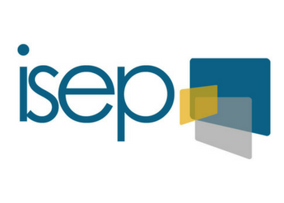

    
    <h1 align="right">NomaBouh | Thomas Bourgeois</h1>
    
"La Vie c'est du Bis-Cuite"

    <h2 align="left">À propos de moi</h2>
    
Bonjour, je m'appelle Thomas. Mon parcours et mes passions peuvent sembler éclectiques, mais se résument en un mot : stimulant. Ce qui me passionne dans l'informatique, c'est la possibilité de relever des défis, de résoudre des problèmes complexes et de créer à partir de rien. C'est une forme de magie moderne où, ligne de code après ligne de code, je peux "jouer à dieu" en créant des mondes et des univers. Plus qu'une passion, c'est ma façon de rendre au monde une partie de ce bonheur que j'ai reçu en grandissant, console en main.

Je ne me définis pas par une réalisation particulière, mais plutôt par ma curiosité insatiable. Que ce soit à travers un bon livre, un film captivant, une nouvelle recette de cuisine, ou une anecdote fascinante, j'aime explorer et apprendre dans divers domaines. Parmi eux, le pixel art, la fantasy, les jeux sous toutes leurs formes, et les énigmes se démarquent.

En ce qui concerne mes convictions, je crois en l'humanité plus qu'en l'individu. Cependant, je reconnais que l'effort individuel mérite d'être reconnu. "Rendons à César ce qui appartient à César !"

Ma philosophie de vie peut se résumer ainsi : "La vie, c'est du bis-cuite". Elle est faite de hauts et de bas, de moments de joie et de difficultés. L'important, c'est ce que nous faisons de ces expériences et comment nous pouvons les utiliser pour enrichir la vie des autres. Car, au bout du compte, nous ne laissons derrière nous que les souvenirs et les impacts de notre passage. Autant faire en sorte qu'ils soient bénéfiques.

    <h2 align="left">Formation</h2>
    
Université de Sherbrooke - Maîtrise en Informatique (Double diplôme)

        
    
ISEP, spécialisation en génie logiciel

    
    
Classe Préparatoire TSI, Lycée Jules Ferry, Versailles

    
Baccalauréat Français, Lycée Jules Ferry, Versailles

    

    <h2>Compétences</h2>
    <table>
        <tr>
            <th>Compétence</th>
            <th>Niveau</th>
        </tr>
        <tr>
            <td>Java</td>
            <td>Avancé</td>
        </tr>
        <tr>
            <td>Python</td>
            <td>Avancé</td>
        </tr>
        <tr>
            <td>Node.js</td>
            <td>Intermédiare</td>
        </tr>
        <tr>
            <td>MongoDB</td>
            <td>Intermédiaire</td>
        </tr>
        <tr>
            <td>Godot / GDScript</td>
            <td>Intermédiare</td>
        </tr>
        <tr>
            <td>C++</td>
            <td>Intermédiare</td>
        </tr>
        <tr>
            <td>C#</td>
            <td>Intermédiare</td>
        </tr>
        <tr>
            <td>JavaScript</td>
            <td>Avancé</td>
        </tr>
        <tr>
            <td>RestCRUD</td>
            <td>Avancé</td>
        </tr>
        <!-- Ajoutez d'autres compétences ici -->
    </table>
    <table>
        <tr>
            <th>Langues</th>
            <th>Niveau</th>
        </tr>
        <tr>
            <td>Français</td>
            <td>Langue Maternelle</td>
        </tr>
        <tr>
            <td>Anglais</td>
            <td>B2 Courant</td>
        </tr>
        <tr>
            <td>Espagnol</td>
            <td>B1 Intermédiare</td>
        </tr>
        <tr>
            <td>Japonais</td>
            <td>A1 Débutant</td>
        </tr>
    </table>

    <h2>Projets en cours</h2>
    <ul>
        <li>Site E-commerce</li>
        <li>Développement d'un jeu vidéo</li>
    </ul>

)

